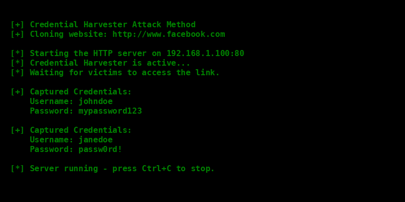

# Phishing para captura de senhas do Facebook

### Ferramentas

- Kali Linux
- setoolkit

### Configurando o Phishing no Kali Linux

1. Acesso root: `sudo su`
2. Iniciando o setoolkit: `setoolkit`
3. Tipo de ataque: `Social-Engineering Attacks`
4. Vetor de ataque: `Web Site Attack Vectors`
5. Método de ataque: `Credential Harvester Attack Method`
6. Método de ataque: `Site Cloner`
7. Obtendo o endereço da máquina: `ifconfig`
8. URL para clone: `http://www.facebook.com`

### Resultados

Abaixo está a simulação dos resultados capturados:

### Observações Importantes

Este conteúdo foi desenvolvido com fins educacionais e de conscientização sobre segurança cibernética. 
É estritamente proibido usar esse conhecimento para atividades maliciosas ou fora de ambientes controlados e autorizados.

**Use o conhecimento de forma ética e responsável.**
